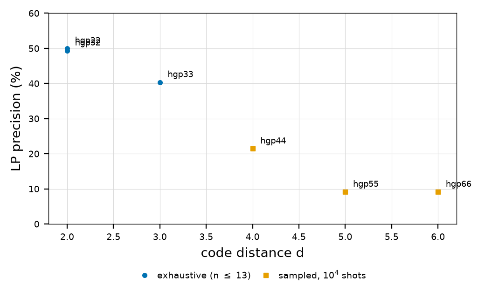
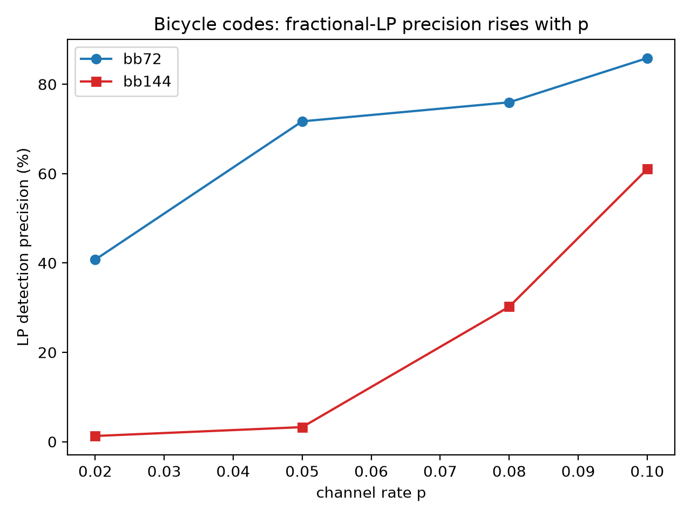

# failuremodes

Failure-mode characterization of belief-propagation (BP) decoding on
degenerate quantum LDPC codes: how much of the avoidable BP failure
comes from degeneracy (multiple minimal errors per syndrome) versus
classical stopping sets, and whether the fractional solutions of the
decoding LP relaxation predict it. Study design in
`failuremodes_plan.md`; full numbers in `results/REPORT.md`; the
research note is `docs/note.pdf`.

  
  

## Claim

> Across the tested degenerate hypergraph-product codes ([[5,1,2]],
> [[8,1,2]], [[13,1,3]]) at code capacity with p = 0.1, 100.0% of
> avoidable BP+OSD failures are degenerate ambiguities, and a
> fractional LP optimum flags an avoidable BP+OSD failure with 47.6%
> precision (100.0% recall); the non-degenerate [[7,1,3]] Steane code
> has no avoidable BP+OSD failures at this p.

## Scaled findings (Rivanna, 20 CUDA runs, fixed seeds)

- 98-100% of avoidable BP+OSD failures on the surface patches
  [[25,1,4]]-[[61,1,6]] are degenerate ambiguities at every p;
  stopping sets contribute zero avoidable failures.
- The LP optimal-face detector keeps 100% recall; precision decays
  with distance (48% at d <= 3, 21% at d = 4, 9% at d = 5-6) but
  rises with p on the bicycle codes (bb72: 52% -> 86%, bb144: 0% ->
  78%).
- About half of BP+OSD failures on the larger patches are avoidable
  at p = 0.1; the rest are true MLD limits.
- [[144,12,12]] almost never wrong-converges (3% of BP failures);
  [[72,12,6]] wrong-converges on ~40% of its BP failures.

## Two scales

- **Exhaustive** (local): five small codes over all 2^n error
  patterns - exact counts, no sampling.
- **Sampled** (HPC): surface patches and bivariate bicycle codes,
  10^4-10^5 seeded shots, an exact MLD oracle solved by enumeration
  (n <= 13) or HiGHS MILP (validated equal), and a batched GPU
  BP+OSD decoder on CUDA.

## Layout

- `src/failuremodes/` - oracle.py (brute-force MLD), ilp_oracle.py
  (MILP), constructed.py (hypergraph product), classify.py
  (stopping sets, convergence), lp_detector.py (optimal-face
  fractionality), bp_only.py, gpu_osd.py + gpu_decoders.py (batched
  CUDA BP+OSD, output-equal to qudec), study.py, report.py
- `scripts/` - run_study.py, aggregate_hpc.py, make_figures.py
- `docs/` - the LaTeX note; `results/` - exhaustive and HPC data
- `hpc/` - Rivanna sync, setup, SLURM sweeps, CUDA probe
- `tests/` - 48 unit tests (47 local, 1 CUDA-only), incl.
  ILP-vs-brute-force and CPU-vs-GPU equality

## Quickstart (offline, uses the sibling qudec repo)

    python3 -m venv --system-site-packages .venv
    .venv/bin/python -m pip install -e ../qudec --no-build-isolation --no-deps
    .venv/bin/python -m pip install -e . --no-build-isolation --no-deps
    .venv/bin/python -m unittest discover -s tests
    .venv/bin/python scripts/run_study.py    # exhaustive five-code study

## HPC (Rivanna)

The decoder stage (batched BP + OSD) runs on CUDA; the HiGHS
LP/MILP stages stay on the CPU. Push, set up the environment once,
and submit:

    bash hpc/sync.sh push && ssh rivanna
    cd ~/scratch/qldpc-bp-degeneracy
    bash hpc/setup.sh
    sbatch hpc/run_hgp_sweep.slurm
    sbatch hpc/run_bb_sweep.slurm

Pull results back and aggregate:

    bash hpc/sync.sh pull
    .venv/bin/python scripts/aggregate_hpc.py

An ADMM parity-polytope study on [[144,12,12]] under phenomenological
noise (measurement errors) lives alongside: see
docs/admm_limits_plan.md, and submit hpc/run_admm_confirm.slurm and
hpc/run_admm_ablate.slurm after setup.
